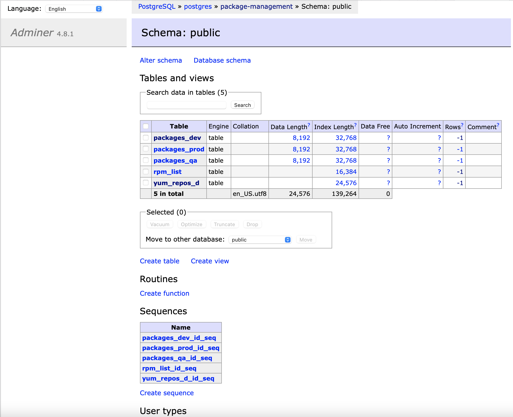

# Package-management


##  About this project
**p.s. This is one of my first python projects, created back in 2020. Please do not judge strictly.**<br></br>
This project was created as an auxiliary tool for the support team.
Its purpose is to display a table with the current version of installed packages, as well as display the newest versions available in yum repositories.

Main functions:
 - Adding new elements to track the current version of the package and the latest one available in yum (one by one or a list).
 - Adding your repositories for tracking in yum.
 - Automatic upgrade of current versions of packages to the newest ones available in yum.

<p align="center">
  
</p><br></br>

##  Repository map
```sh
.
├── CHANGELOG.md                ### All notable changes to this project will be documented in this file
├── Dockerfile                  ### Manifest for building docker-image
├── LICENSE                     ### License info
├── README.md                   ### The file you're reading now
├── docker-compose.yml          ### Manifest for building and running project with all dependencies
├── docker-entrypoint-initdb.d  ### Scripts for configuring the postgres instance
│   └── init-db.sh                # Database setup script and fixtures for filling the database with test data
├── requirements.txt            ### List of python dependencies
├── doc                         ### Content for documentation
    ├── adminer.png
    ├── main.png
    ├── package-management_add-package.gif
    ├── package-management_add-repository.gif
    ├── package-management_find-new-version.gif
    ├── package-management_hashstring.gif
    ├── package-management_import.gif
    ├── package-management_packages-list.gif
    ├── package-management_tabs.gif
    ├── package-management_updating-version_all.gif
    ├── package-management_updating-version_once.gif
    └── webapp.png
└── src                         ### Source code
    ├── _main_.py                 # Main file with code this project
    ├── database.py               # A module with a class for working with a database
    ├── packages.py               # A module with a class for working with yum packages and repositories
    ├── static                    # Directory with static css and pictures
    │   ├── css                   # CSS styles for templates
    │   │   ├── button.css
    │   │   ├── main.css
    │   │   ├── popup.css
    │   │   ├── select_list.css
    │   │   └── tabs.css
    │   ├── import_env_error.png
    │   ├── package_ico.png
    │   ├── top-button.png
    │   └── wat_error.jpg
    └── templates               ### Director with page templates for flask rendering
        ├── button_up.html
        ├── buttons.html
        ├── error.html
        ├── footer.html
        ├── gen_hash_textarea.html
        ├── header.html
        ├── import_packages.html
        ├── index.html
        ├── link_href.html
        ├── package_list.html
        ├── repo_rpm_list.html
        ├── repo_yum_list.html
        └── repository.html
```

##  Requirements
-  PostgreSQL - [fixtures](docker-entrypoint-initdb.d/init-db.sh)
-  Almalinux 9 - [The operating system that this project needs to support](https://hub.docker.com/layers/library/almalinux/9.1/images/sha256-33352d3571a24a86ac08ef0eb7b06f21c189bd4f7087a825169046d9af263991?context=explore)
-  Yum - [Package Manager](https://ru.wikipedia.org/wiki/Yum)

##  Environment variables

| Variable  | Description | Default |
| ------------- | ------------- | ------------- |
| `POSTGRES_URL`  | IP address or fqdn to the host with the database | `postgres` |
| `POSTGRES_USER`  | Name of the user to connect to the database | `python` |
| `POSTGRES_PW` | Password to connect to the database | `python` |
| `POSTGRES_DB` | Name of the database to store the data | `package-management` |
| `TIMEOUT_DB_INIT` | Waiting time for database initialization and filling it with fixtures | `15` |
| `APP_VERSION` | Application version | `0.0.0` |
| `APP_ENV` | Application launch environment | `DEBUG` |


##  How to run with docker-compose
1. Building and launching all services with dependencies in docker-compose
```sh
docker-compose up -d
```
2. Viewing logs
```sh
docker logs -f package-management
```


##  Resources

### DBs viewing in browser
http://0.0.0.0:8080
<br></br>

### Web viewing
http://0.0.0.0
<br></br>

### Fixtures and a test data for postgres
**Fixture file: [init-db.sh](docker-entrypoint-initdb.d/init-db.sh)**

The fixtures configure the postgres database for the operation of the web application.

The fixtures also contain a set of test data to demonstrate the operation of the application.

##  How to build a docker image
```sh
export APP_VERSION=v1.0.0
docker build -t ghcr.io/${GITHUB_USERNAME}/package-management:${APP_VERSION} .
docker push ghcr.io/${GITHUB_USERNAME}/package-management:${APP_VERSION}
```

## Documentation
### Tracking the current versions of packages installed on the servers of the selected environment
<p align="left">
  
</p>

### Add a new tracking package
<p align="left">
  
</p>

### Tabs with different server environments
<p align="left">
  
</p>

### Search for the latest versions of packages in yum repositories
<p align="left">
  
</p>

### If information about packages could not be found in the standard yum repositories, you can add additional repositories through a special section
<p align="left">
  
</p>

### Update the current version of the package to the newest one available in the yum repository (one package at a time)
<p align="left">
  
</p>

### Update the current version of the package to the newest one available in the yum repository (all packages in the selected environment at once)
<p align="left">
  
</p>

### Get a list of packages with the currently installed version to the clipboard
<p align="left">
  
</p>

### Importing packages in a list to the table of the selected environment
<p align="left">
  
</p>
